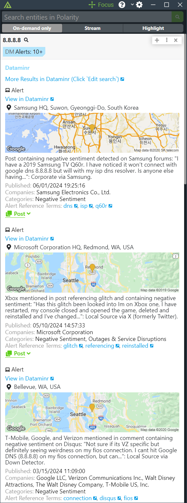

# Polarity - Dataminr Pulse Integration

Dataminr delivers the earliest warnings on high impact events and critical information far in advance of other sources.

The Polarity Dataminr Pulse integration allows Polarity to search Dataminr by all entities to get related Alerts.  The integration will return the 10 most recent related Alerts.  The integration also includes the ability to pin alerts to the top of Polarity for instant notification.

For more information on Dataminr, please visit [official website](https://www.dataminr.com/).

|  |
|---------------------------------------------|
| *Alerts Example*                            |

## Dataminr Integration Options
### Dataminr API URL
The base URL of the Dataminr API including the schema (i.e., https://)
- Default: `https://api.dataminr.com`
- Admin Only: Yes

### Client ID
Your Client ID Credential
- Admin Only: Yes

### Client Secret
Your Client Secret Credential
- Admin Only: Yes

### Pin Dataminr Alerts
Pin Dataminr Alerts to the top of the Polarity UI
- Default: `false`
- User Editable: Yes

### Filter Lists to Watch
Filter the lists to watch for alerts
- Default: `[]` (all lists)
- User Editable: Yes
- Multiple Selection: Yes

### Filter Alert Types
Filter the type of alert
- Default: [`flash`, `urgent`, `alert`]
- User Editable: Yes
- Multiple Selection: Yes

### Poll Interval
The interval in seconds for the server to poll for new Alerts
- Default: `60` seconds
- Minimum: `30` seconds
- Admin Only: Yes

## Rate Limiting

The integration implements automatic rate limiting based on the Dataminr API's response headers. This prevents 429 (Too Many Requests) errors without requiring manual configuration.

**How it works:**
- Starts with sane defaults: 6 requests per 30-second window
- Monitors `x-ratelimit-limit`, `x-ratelimit-remaining`, and `x-ratelimit-reset` headers from every API response
- Automatically adjusts rate limiting based on the actual API limits
- Waits when quota is exhausted, using the API's `x-ratelimit-reset` value for precise timing
- No user configuration needed - the integration adapts to the API's rate limits automatically

**Note:** Rate limiting is applied only to Dataminr API calls, not to authentication token requests.

## Installation Instructions

Installation instructions for integrations are provided on the [PolarityIO GitHub Page](https://polarityio.github.io/).

## Polarity

Polarity is a memory-augmentation platform that improves and accelerates analyst decision making.  For more information about the Polarity platform please see:

https://polarity.io/
